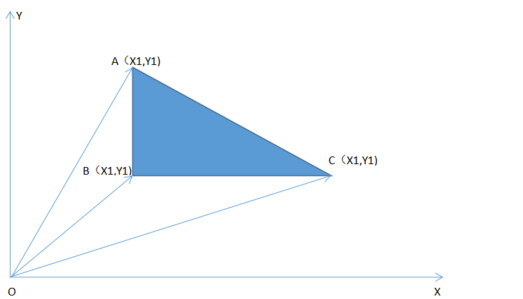

## 2036 改革春风吹满地

### 一、题目

#### 问题描述

> “ 改革春风吹满地,
> 不会AC没关系;
> 实在不行回老家，
> 还有一亩三分地。
> 谢谢!（乐队奏乐）”
>
> 话说部分学生心态极好，每天就知道游戏，这次考试如此简单的题目，也是云里雾里，而且，还竟然来这么几句打油诗。
> 好呀，老师的责任就是帮你解决问题，既然想种田，那就分你一块。
> 这块田位于浙江省温州市苍南县灵溪镇林家铺子村，多边形形状的一块地，原本是linle 的，现在就准备送给你了。不过，任何事情都没有那么简单，你必须首先告诉我这块地到底有多少面积，如果回答正确才能真正得到这块地。
> 发愁了吧？就是要让你知道，种地也是需要AC知识的！以后还是好好练吧...

#### 输入数据

> 输入数据包含多个测试实例，每个测试实例占一行，每行的开始是一个整数n(3<=n<=100)，它表示多边形的边数（当然也是顶点数），然后是按照逆时针顺序给出的n个顶点的坐标（x1, y1, x2, y2... xn, yn）,为了简化问题，这里的所有坐标都用整数表示。
> 输入数据中所有的整数都在32位整数范围内，n=0表示数据的结束，不做处理。

#### 输出数据

> 对于每个测试实例，请输出对应的多边形面积，结果精确到小数点后一位小数。
> 每个实例的输出占一行。

#### 输入样例

> 3 0 0 1 0 0 1
>
> 4 1 0 0 1 -1 0 0 -1 
>
> 0

#### 输出样例

> 0.5 
>
> 2.0

#### 题目来源

> HDU 2036 http://acm.hdu.edu.cn/showproblem.php?pid=2036

#### 解题思路

> 此题是一道计算面积的问题。由于输入的是各点的坐标，故我们可以通过向量方法去计算多边形的面积。不妨先拿最简单的三角形举例。如图所示求三角形ABC的面积的问题，就转化为了求三角形OAB,OBC,OAC的面积的问题。而这三个三角形的面积，很容易使用向量法求解。
>
> S△ABC=-S△OAB-S△OBC+S△OAC=(X1Y2-X2Y1)+(X2Y3-X3Y2)+(X3Y1-X1Y3)。
>
> 以此类推,当图形为n边形时，
>
> |S|=(X1Y2-X2Y1)+(X2Y3-X3Y2)+···+(Xn-1Yn-XnYn-1）+(XnY1-X1Yn)。	
>
> 

#### 参考程序

```c++
#include<stdio.h>
#include<math.h>
int main()
{
    int n,x[100],y[100];
    double S;
    while(scanf("%d",&n)&&n)
    {
        S=0;
        for(int i=0; i<n; i++)
        {
            scanf("%d",&x[i]);
            scanf("%d",&y[i]);
        }
        for(int i=0; i<n-1; i++)//向量方法计算多边形的面积
        {
            S=S+x[i]*y[i+1]-x[i+1]*y[i];
        }
        S=S+x[n-1]*y[0]-x[0]*y[n-1];

        S=S/2;
        printf("%.1lf\n",fabs(S));//输出的是绝对值
    }
    return 0;
}
```

#### 复杂度分析

> 复杂度为O（n）。

#### 编程技巧

> （1）使用循环一次计算各个向量三角形的面积，当值为负时，表示减去该三角形面积，当值为正时，表示加上该三角形面积。故此公式既适用于凸多边形，也适用于凹多边形。
>
> （2）注意当输入n为0时，程序结束。
>
> （3）注意输出的是S的绝对值。