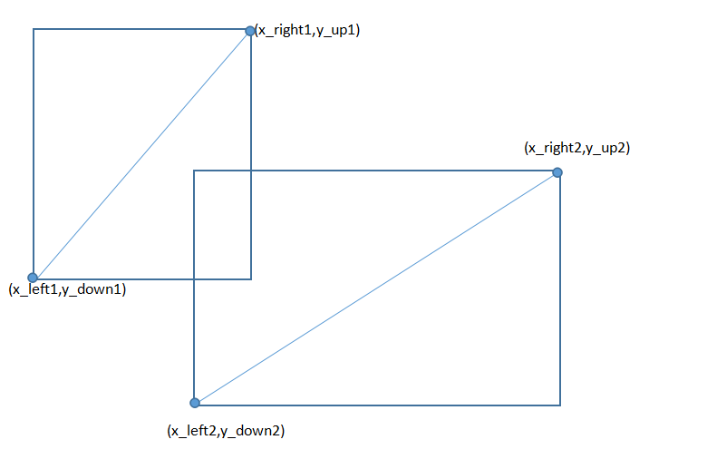

## 2056 Rectangles

### 一、题目

#### 问题描述

> Given two rectangles and the coordinates of two points on the diagonals of each rectangle,you have to calculate the area of the intersected part of two rectangles. its sides are parallel to OX and OY . 

#### 输入数据

> Input The first line of input is 8 positive numbers which indicate the coordinates of four points that must be on each diagonal. The 8 numbers are x1,y1,x2,y2,x3,y3,x4,y4.That means the two points on the first rectangle are(x1,y1),(x2,y2);the other two points on the second rectangle are (x3,y3),(x4,y4). 

#### 输出数据

>  Output For each case output the area of their intersected part in a single line. accurate up to 2 decimal places. 
>

#### 输入样例

>  1.00 1.00 3.00 3.00 2.00 2.00 4.00 4.00 
>
>  5.00 5.00 13.00 13.00 4.00 4.00 12.50 12.50 

#### 输出样例

>  1.00 
>
>  56.25 

#### 题目来源

> HDU 2056 http://acm.hdu.edu.cn/showproblem.php?pid=2056

#### 解题思路

> 为了便于观察，我们将两个矩形上的两点都转化为左下和右上的两点。
>
> 
>
> .png)
>
> 如图所示，我们容易发现，当且仅当x_right1>x_left2且x_left1<x_right2且y_up1>y_down2且y_up2>y_down1时两个矩形有重合部分。且重合部分的长为(min(y_up2,y_up1)-max(y_down1,y_down2))的绝对值，宽为min(x_right2,x_right1)-max(x_left1,x_left2)的绝对值。

#### 参考程序

```c
#include <stdio.h>
#include <math.h>
double max(double x,double y) {
	return x>y?x:y;
}
double min(double x,double y) {
	return x<y?x:y;
}
int main() {
	double x1,x2,x3,x4,y1,y2,y3,y4,x,y;
	double x_right1,x_right2,x_left1,x_left2,y_up1,y_up2,y_down1,y_down2;
	while(~scanf("%lf%lf%lf%lf%lf%lf%lf%lf",&x1,&y1,&x2,&y2,&x3,&y3,&x4,&y4)) {
        //将矩形上的两点转化为左下和右上的两点
		x_right1=max(x1,x2);
		x_right2=max(x3,x4);
		x_left1=min(x1,x2);
		x_left2=min(x3,x4);
		y_up1=max(y1,y2);
		y_up2=max(y3,y4);
		y_down1=min(y1,y2);
		y_down2=min(y3,y4);
        //判断是否有重合部分
		if(x_left1>=x_right2||x_left2>=x_right1||y_down1>=y_up2||y_down2>=y_up1)
			printf("0.00\n");
		else {
            //计算长宽，输出面积
			x=fabs(min(y_up2,y_up1)-max(y_down1,y_down2));
			y=fabs(min(x_right2,x_right1)-max(x_left1,x_left2));
			printf("%.2lf\n",x*y);
		}
	}
	return 0;
}
```

#### 复杂度分析

> 无

#### 编程技巧

> （1）注意相切和相离的情况。
>